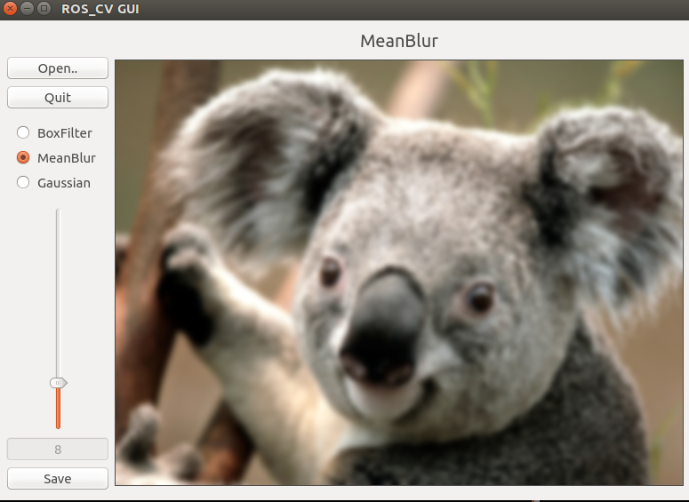

## Author
- **Welin**  2018.03.17

## Description
In this project, it provides how to use ROS and OpenCV to make Qt GUI.
An interface guide to implement the image processing.

## TODO
```sh
    $ mkdir -p catkin_ws/src
    $ cd catkin_ws/src
```

git clone the project from the corrent URL

```
    $ cd ..
    $ catkin_make
    $ source devel/setup.bash
```

Then, "rosrun ros_cv_gui ros_cv_gui_node" to test the project. Note the right YAML file path. The effect may work like below:



